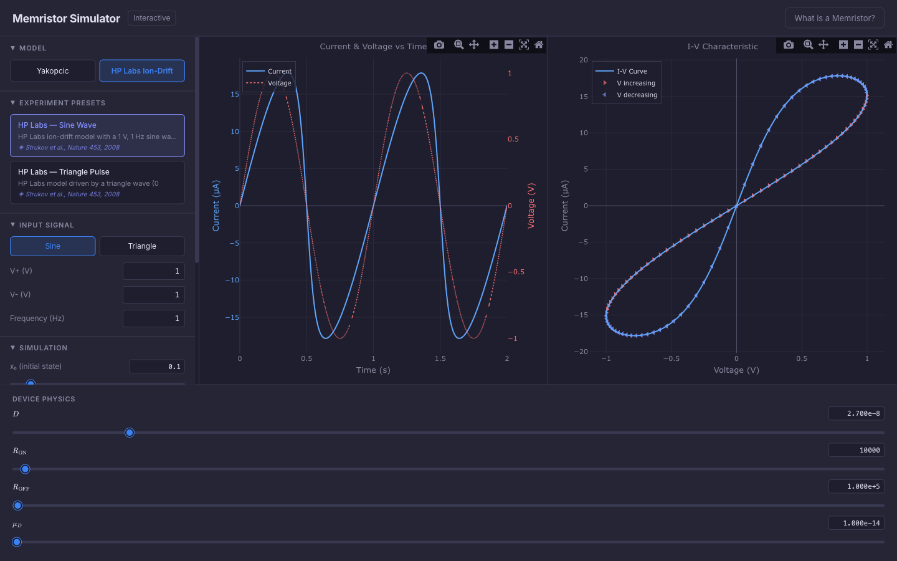
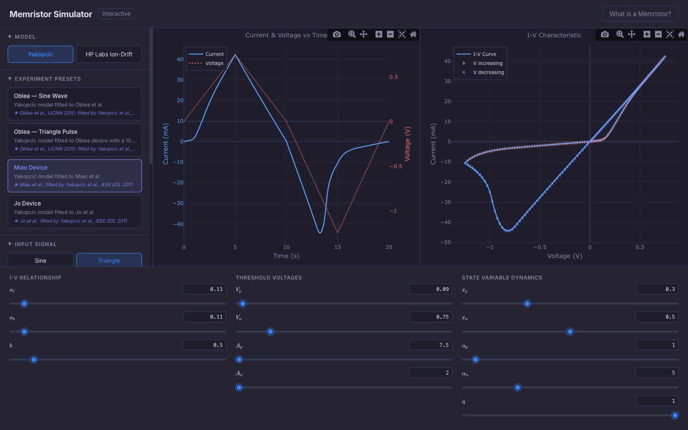
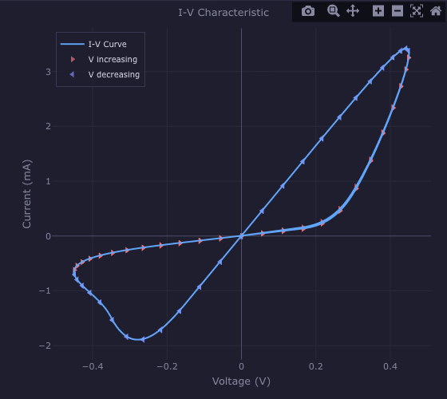

# Memristor Simulator

An interactive, browser-based simulator for HP Labs Ion-Drift and Yakopcic generalised memristor models. Explore memristive switching behaviour in real time with adjustable parameters, multiple experiment presets, and dark-themed Plotly charts — no backend required.



## Features

- **Two memristor models** — HP Labs Ion-Drift and Yakopcic Generalised, with full parameter control
- **6 experiment presets** reproducing published device characterisations (Strukov, Oblea, Miao, Jo)
- **Real-time ODE solver** — adaptive Dormand-Prince (RK45) integration with dense output interpolation
- **Interactive parameter sliders** with LaTeX labels and grouped categories (I-V relationship, thresholds, state dynamics)
- **Dark-themed Plotly charts** — dual-panel time-series and I-V characteristic plots with direction markers
- **Educational content** — built-in "What is a Memristor?" intro, model descriptions, and parameter tooltips with paper citations
- **Fully client-side** — runs entirely in the browser, no server or backend needed

## Quick Start

```bash
cd memristor-sim
npm install
npm run dev
```

Open [http://localhost:5173](http://localhost:5173) in your browser.

## Models

### HP Labs Ion-Drift

Linear ion-drift model for TiO₂ thin-film memristors [1]. The device is modelled as two resistors in series (doped and undoped regions), with the boundary moving under applied voltage:

$$M(x) = R_{\text{ON}} \cdot x + R_{\text{OFF}} \cdot (1 - x)$$

Supports Joglekar, Biolek, and Anusudha window functions to handle boundary effects.

### Yakopcic Generalised

Generalised behavioural model [2] applicable to many oxide-based memristors. Uses a sinh-based I-V relationship with threshold-gated state evolution:

$$I = a_1 x \sinh(bV) \quad (V \geq 0), \qquad I = a_2 x \sinh(bV) \quad (V < 0)$$

Fitted to published data from Oblea [3], Miao [4], and Jo devices [5].

## Experiment Presets

| Preset | Model | Signal | Description | Source |
|--------|-------|--------|-------------|--------|
| HP Labs — Sine Wave | HP Labs | 1 Hz sine, 1 V | Basic pinched hysteresis on 27 nm TiO₂ | Strukov et al. [1] |
| HP Labs — Triangle Pulse | HP Labs | 0.5 Hz triangle, 1 V | DC sweep on 85 nm device | Strukov et al. [1] |
| Oblea — Sine Wave | Yakopcic | 100 Hz sine, 0.45 V | Fast sub-ms switching in Nb-doped SrTiO₃ | Oblea et al. [3] |
| Oblea — Triangle Pulse | Yakopcic | 100 Hz triangle, 0.25 V | Asymmetric SET/RESET, low voltage | Oblea et al. [3] |
| Miao Device | Yakopcic | Triangle, +0.75/−1.25 V | Strongly asymmetric I-V, low thresholds | Miao et al. [4] |
| Jo Device | Yakopcic | Triangle, +4/−2 V | High-resistance device, sharp switching | Jo et al. [5] |



## Screenshots

| I-V Characteristic (Oblea sine) | Parameter Sliders (Yakopcic) |
|:---:|:---:|
|  |  |

## Architecture

**Tech stack:** React 19 + TypeScript, Vite, Zustand (state management), Plotly.js (charts), KaTeX (math rendering).

```
memristor-sim/src/
├── engine/                  # Pure simulation logic (no React)
│   ├── models/              # HP Labs & Yakopcic model implementations
│   ├── signals/             # Sine & triangle input signal generators
│   ├── solver.ts            # Adaptive Dormand-Prince (RK45) ODE solver
│   ├── simulate.ts          # Main simulation loop
│   ├── presets.ts           # 6 experiment configurations from literature
│   └── windows.ts           # Joglekar, Biolek, Anusudha window functions
├── components/
│   ├── controls/            # Model selector, presets, sliders, signal config
│   ├── plots/               # I-V curve and time-series Plotly charts
│   ├── layout/              # Header, sidebar, parameter bar
│   ├── education/           # Memristor intro, model descriptions, tooltips
│   └── ui/                  # Shared UI primitives (Tooltip)
├── content/                 # Educational text & parameter descriptions
├── stores/                  # Zustand simulation state store
├── styles/                  # Global CSS
└── App.tsx                  # Root layout
```

## Legacy Code

The repository also contains the original Python/MATLAB/SPICE implementations from the research project:

- `simulate.py` — CLI experiment runner with solver selection and video export
- `hp_labs_interactive.py` / `yakopcic_interactive.py` — matplotlib-based interactive GUIs
- `fit_interactive.py` — Tkinter fitting application for matching real device data
- `models.py` — Python model implementations (HP Labs, Yakopcic, updated Yakopcic [6])
- `experiments.py` — experiment definitions, `functions.py` — helper utilities
- `MATLAB/` and `SPICE/` — alternative implementations


## References

*[1] Yang, J. J. et al. Memristive switching mechanism for metal/oxide/metal nanodevices. Nat Nanotechnol 3, 429-433 (2008).*

*[2] Yakopcic, C., Taha, T. M., Subramanyam, G., Pino, R. E. & Rogers, S. A Memristor Device Model. IEEE Electr Device L 32, 1436-1438 (2011).*

*[3] Oblea, A. S., Timilsina, A., Moore, D. & Campbell, K. A. Silver Chalcogenide Based Memristor Devices. 2010 Int Jt Conf Neural Networks IJCNN 1, 1-3 (2010).*

*[4] Miao, F. et al. Anatomy of a Nanoscale Conduction Channel Reveals the Mechanism of a High-Performance Memristor. Adv Mater 23, 5633-5640 (2011).*

*[5] C. Yakopcic, T. M. Taha, G. Subramanyam, and R. E. Pino, "Generalized Memristive Device SPICE Model and its Application in Circuit Design," IEEE Transactions on Computer-Aided Design of Integrated Circuits and Systems, 32(8) August, 2013 pp. 1201-1214.*

*[6] Yakopcic, C. et al. Memristor Model Optimization Based on Parameter Extraction From Device Characterization Data. IEEE T Comput Aid D 39, 1084-1095 (2020).*
